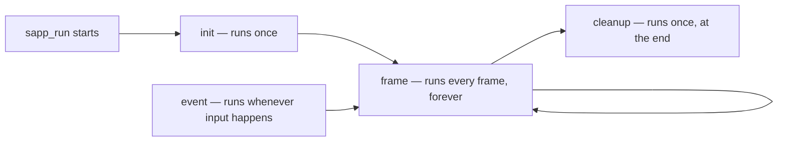

## List of Contents

- [[#What is Sokol?]]
- [[#The Coding with Sphere Tutorial]]
	- [[#First Video Tutorial]]
		- [[#Setup Project Structure]]
		- [[#Initialise Window]]
		- [[#Deviating From Coding with Sphere]]
		- [[#Initialise Graphics]]
		- [[#Wait, What Are We Doing?]]
		- [[#Going Back To It]]
	- [[#Second Video Tutorial]]
		- [[#Some Random Notes For Triangles And Stuff]]
		- [[#Writing The Vertex Data]]
		- [[#Writing Shaders]]

---

# What is Sokol?

> [!NOTE] Resource(s)
> 
> - Sokol GitHub Repository: https://github.com/floooh/sokol

Compared to [raylib](https://www.raylib.com/) that we used in our, "*semi-failed*" [mouse-c-py](https://github.com/Sunhaloo/mouse-c-py) project. Sokol is much *lighter* both in terms of **file size** and also provides little to **no abstraction** over the GPU API.

raylib can be seen as "*batteries-included*" while to be able to work with Sokol; you are going to have to understand and build the whole rendering pipeline in order to "*draw*" stuff on the screen.

For example, when we did our little GUI with raylib, we cloned the entire repository and then ran the *correct* `make` command to build the library file on our system. Here, there is **nothing** to *build*, its just a "*grab what you need*" type-of-thing.

# The Coding with Sphere Tutorial

Here are the list of videos made by [Coding with Sphere](https://www.youtube.com/@codingwithsphere) that we are going to be following in order:

1. Introduction and Setup: https://www.youtube.com/watch?v=GCnipL4T0Ho
2. Creating Triangle: https://www.youtube.com/watch?v=FFpSEo3geL4
3. Going 3D: https://www.youtube.com/watch?v=e23SJ-6zUrk

## First Video Tutorial

### Setup Project Structure

Below you are going to see how I setup the project structure for this tutorial. Compared to his project structure, I simply renamed the `vender` directory to `dependencies` as its more remember-able for me.

- Here is how my project structure is looking like:

```console
 .
├── 󱧼 build
├──  dependencies
│   └──  sokol
└──  main.c
```

> For the `sokol` folder, we simply `clone` the entire Sokol project... I think you know how to do that!

> [!NOTE]
> The main Sokol **header file** is the `sokol_app.h` file. Similar to what I said about how we should take a look at it even if we don't understand anything.
> 
> > You should definitely take a look and read it as I think the comments are really good for educational purposes!

### Initialise Window

#### Include Sokol's Header File

- Here is what our `main.c` file should have in order to use `sokol_app.h`:

```C
#define SOKOL_APP_IMPL
#define SOKOL_GLCORE
#define SOKOL_NO_ENTRY
#include "dependencies/sokol/sokol_app.h"
```

I need to explain how the preprocessor works before we move onto explaining the above "*includes*" as I also did not explain myself that when I was building our GUI for mouse-c-py.

So let's say that we defined this macro at the top of our file:

```C
#define COUNT 5
#define LEN(arr) (sizeof(arr) / sizeof(arr[0]))
```

Therefore, we can use `COUNT` instead of '5' wherever we need to, for example in a `for` loop and also; whenever we need to find the size of an array, we could simply pass the array into the `LEN` macro instead of typing the long `sizeof` *thingy* to find the length of said array.

What the preprocessor is going to do when it simply read our code; its going to go about and **replace** these *macros* like `COUNT` and `LEN` into the actual *values* ( which in this case is '5' and `sizeof(arr) / sizeof(arr[0])` ).

- But we can also *guard* and do *conditional compilation* like so:

> I am just using the `sokol_app.h` as example, in this case.

```C
// declaration guard: stops declarations being pasted twice into this file
#ifndef SOKOL_APP_INCLUDED
#define SOKOL_APP_INCLUDED
// function declarations / structs / enums go here - always visible
#endif

// implementation guard: controls whether the actual code gets compiled here
#if defined(SOKOL_APP_IMPL)
// actual function bodies go here - only visible in the ONE file that defines SOKOL_APP_IMPL
#endif
```

> [!WARNING]
> The above code block was given by [Claude](https://claude.ai)!
> 
> I think it's good but still given that I don't really know what I am doing... I need to ask someone knowledgeable about it.

- So right now in our `main.c` file we have the following line of *code*:

```C
#define SOKOL_APP_IMPL
```

This basically means that our `main.c` file "*owns*" the actual implementation of the function found inside the `sokol_app.h` header file. Therefore, let's say that we have another `test.c` file whereby we only have the **actual** `include "<path to sokol_app.h>"` file... The **linker** is going to check where the functions, we are using in `test.c`, are actually **defined** at.

> [!WARNING]
> If we were to use multiple `#define SOKOL_APP_IMPL`; the linker would not actually know what to choose from and it will result in a "*multiple definition*" error.
> 
> > Its like it does **not** have a source of truth!

- Therefore, at the end of this; we should have a `main.c` file that looks something like this:

```C
// own the function implementation found in sokol's header file
#define SOKOL_APP_IMPL
// Linux: using OpenGL's API to communicate with GPU
#define SOKOL_GLCORE
// NOTE: please read line 1154 of "our" `sokol_app.h` header file
#define SOKOL_NO_ENTRY
// include the actual sokol header file
#include "dependencies/sokol/sokol_app.h"

// our main function
int main() { return 0; }
```

#### Creating The Window

> [!NOTE]
> You are going to hear 'Coding with Sphere' talk about **callbacks** when he is showing us what to pass inside the `sapp_run` function.
> 
> > Do you remember function pointers?
> 
> Well, its the same thing... Instead of us calling and using the function directly, we simply pass **our** function that we defined in `sapp_desc` structure and then its going to get *called backed* whenever that point of time is reached.
> 
> > Or something like that.

So basically, compared to raylib and specially raygui whereby we did everything inside a `while` loop as it was an *immediate-mode-gui* library. Here we are going things the traditional way of whereby we are going to write functions / events that are going to be called at runtime.

- Therefore, here is how our `main.c` file currently looks like:

```C
// own the function implementation found in sokol's header file
#define SOKOL_APP_IMPL
// Linux: using OpenGL's API to communicate with GPU
#define SOKOL_GLCORE
// NOTE: please read line 1154 of "our" `sokol_app.h` header file
#define SOKOL_NO_ENTRY
// include the actual sokol header file
#include "dependencies/sokol/sokol_app.h"

// function related to `sapp_run` and `sapp_desc`
void init(void) {};
void frame(void) {};
void cleanup(void) {};
void event(const sapp_event *event) {};

// our main function
int main() {
  // initialise our application ==> windowing, GPU setup...
  sapp_run(&(sapp_desc){
    // setup main point
    .init_cb = init,
    .frame_cb = frame,
    .cleanup_cb = cleanup,
    .event_cb = event
  });

  return 0;
}
```

- Try compiling with the following command:

```bash
# compiling with `clang`
clang main.c -Wall -Wextra -lX11 -lXi -lXcursor -lGL -lasound -ldl -lm -o build/program
```

> [!NOTE]
> I have always used `gcc` to compile my `.c` file and I think I will continue to use it.
> 
> But I always... Most of the time, I see 'Coding with Sphere' uses `clang` more often that not. Asking Claude about it. It tells me that it is "*better*" ( *or should be at least* ).
> 
> GCC was build by the guys over at GNU Project while [Clang](https://clang.llvm.org/) was built on-top of [LLVM](https://llvm.org/) ( *ohh, its the dragon logo* ) which originated at Apple ( *I do hold a grudge against them* ).
> 
> Claude tells me that it give **better** warnings, should compile faster in larger projects and also lower memory use compared to GCC.

> [!IMPORTANT]
> They are completely different things that do happen to compile `.c` files.
> 
> What I am trying to say is that its **not** really an improvement over GCC. They did address the "*issues*" of GCC but they are like: "_Different people trying to solve the **same** problem in there own way_" type of thing.

> [!SUCCESS]
> Running our `./build/program` binary, I do see a black window appears!

#### Writing Makefile

Therefore, I am going to write a simple `Makefile` so that we can use instead of writing that long `clang` command.

```bash
CC = clang
OUTPUT = build/program

program: compile run clean

compile:
	@$(CC) main.c -Wall -Wextra -lX11 -lXi -lXcursor -lGL -lasound -ldl -lm -o $(OUTPUT)

run:
	@./build/program

clean:
	@rm ./build/program
```

### Deviating From Coding with Sphere

So looking and reading at the `sokol_app.h` **header file**. I am seeing a lot of interesting stuff that I think could be... Well, *interesting*.

After my mouse-c-py "*semi-failed*" project; I said to myself that I am **not** going to write Window's C code anymore.

> But I just can't help seeing and trying these interesting things.

Therefore, I am going to try to make this project also works on Windows.

#### Interesting Things That I Keep Seeing

Here are the interesting things that I keep seeing; therefore, making want to try to make this work on Windows systems using [MSYS2](https://www.msys2.org/).

- Selection of 3D-APIs:

```C
/*
    In the same place define one of the following to select the 3D-API
    which should be initialized by sokol_app.h (this must also match
    the backend selected for sokol_gfx.h if both are used in the same
    project):

        #define SOKOL_GLCORE
        #define SOKOL_GLES3
        #define SOKOL_D3D11
        #define SOKOL_METAL
        #define SOKOL_WGPU
        #define SOKOL_VULKAN
        #define SOKOL_NOAPI
*/
```

- Documentation of 3D-APIs on Linux:

```C
/*
    - on Linux:
        - all backends: X11, Xi, Xcursor, dl, pthread, m
        - with SOKOL_GLCORE: GL
        - with SOKOL_GLES3: GLESv2
        - with SOKOL_WGPU: a WebGPU implementation library (tested with webgpu_dawn)
        - with SOKOL_VULKAN: vulkan
        - with EGL: EGL

    On Linux, you also need to use the -pthread compiler and linker option, otherwise weird
    things will happen, see here for details: https://github.com/floooh/sokol/issues/376

    For Linux+Vulkan install the following packages (or equivalents):
        - libvulkan-dev
        - vulkan-validationlayers
        - vulkan-tools
*/
```

- Documentation of 3D-APIs on Windows:

```C
/*
    - on Windows:
        - with MSVC or Clang: library dependencies are defined via `#pragma comment`
        - with SOKOL_WGPU: a WebGPU implementation library (tested with webgpu_dawn)
        - with SOKOL_VULKAN:
            - install the Vulkan SDK
            - set a header search path to $VULKAN_SDK/Include
            - set a library search path to $VULKAN_SDK/Lib
            - link with vulkan-1.lib
        - with MINGW/MSYS2 gcc:
            - compile with '-mwin32' so that _WIN32 is defined
            - link with the following libs: -lkernel32 -luser32 -lshell32
            - additionally with the GL backend: -lgdi32
            - additionally with the D3D11 backend: -ld3d11 -ldxgi
*/
```

> [!TIP]
> I think we should give it a try!
> 
> > What's the worst that could happen... "*Famous Last Words*"

> [!NOTE]
> > I am thoroughly going to use the help of Claude here for the Windows part because [Fuck Microsoft](https://www.youtube.com/watch?v=2zpCOYkdvTQ&t=22s)!
> 
> Okay, so apparently, and yes ( *what the fuck I am saying now... I need to take a break* ); Windows does support OpenGL so therefore, to compile and run our current `main.c` file, right now on Windows, we don't actually need to touch anything.
> 
> > Very Nice!
> 
> Nevertheless, we are going to have to **update** our `Makefile` so that it does allow compilation on Windows systems.

- Our updated `Makefile`:

```bash
# compiler to use
CC = clang

# check if we are on a Windows / Linux system
ifeq ($(OS),Windows_NT)
	# Windows system
  OUTPUT = build/program.exe
  LIBS = -lkernel32 -luser32 -lshell32 -lgdi32
else
	# Linux system
  OUTPUT = build/program
  LIBS = -lX11 -lXi -lXcursor -lGL -lasound -ldl -lm -pthread
endif

# local development ==> compiling, running and deleting
program: compile run clean

# compile the program according to system
compile:
	@$(CC) main.c -Wall -Wextra $(LIBS) -o $(OUTPUT)

# compile the program
run:
	@./$(OUTPUT)

# delete / remove any leftover compiled programs ( based on system )
clean:
	@$(RM) $(OUTPUT)
```

#### Creation of GitHub Repository

I am including this here as its going to be the first time that I am going to be using `git submodules`.

Here are all the steps that I took to create the GitHub Remote Repository:

1. Create GitHub repository
	- No `.gitignore`
	- License: MIT
2. Clone GitHub repository locally
3. Add required stuff like `main.c`, `Makefile` to repository
4. Add Git sub-module using: `git submodule add https://github.com/floooh/sokol dependencies/sokol`
	- This cloned the current latest version of Sokol
5. Pin down the current version so that my program does not break when someone tries to clone it
	- Pinning down to commit `28f9d8d44d92dab8536791a9f7d13d7e911a2b39` using `git checkout 28f9d8d44d92dab8536791a9f7d13d7e911a2b39`
	- Check using `git submodule status`
6. Add, Commit and Push
7. Clone again using either:
	- `git clone --recurse-submodules https://github.com/Sunhaloo/sokol-3D-model-viewer.git`
	- `git clone --recurse-submodules git@github.com:Sunhaloo/sokol-3D-model-viewer.git`

> [!WARNING]
> If you simply clone **without** the `--recurse-submodules` flag, then you are going to see the `dependencies/sokol` *repository* is going to be empty...
> 
> Therefore, you simply need to run the following command to populate it again:
> 
> ```bash
> # populate the `dependencies/sokol` repository
> git submodule update --init
> ```

#### It Works!

So booting in my Windows partition, cloning the repository... The program does indeed work **without** any changes made to the `main.c` file!

> [!NOTE]
> This could mean we might be able to code it entirely on Linux and simply *use it* on Windows.
> 
> > I think I should have used Sokol and [Dear ImGui](https://github.com/ocornut/imgui) instead for my mouse-c-py project...

## Initialise Graphics

We are now going to use the `sokol_gfx.h` **header file** which from what I see in the comments upon reading the first couple lines of it; its a "*simple 3D API wrapper*".

So compared to our `sokol_app.h` file which is basically responsible for creating a **window** and basic **event handling**... `sokol_gfx.h` is going to be the one who puts *pixels* on the screen and actually talks to the GPU.

> [!WARNING]
> > Help is needed by `sokol_gfx.h`!
> 
> Given that we have already set up the GPU communication over at `sapp_run`. Here we are going to basically have to tell `sokol_gfx.h` about that *existing connection* that we made; which backend context is active ( *in our case `SOKOL_GLCORE`* ) and some pixel format.
> 
> Basically, we are going to have to setup the environment in such a way that its able to use the backend. Well to be able to do that, the developers have already created a helper function for this and it's call `sglue_environment` which does everything for us.
> 
> Hence to use it, we are also going to have to add the `sokol_glue.h` header file.

- Therefore, to use it; simply include it at the top of our `main.c` file like so:

```C
// own the function implementation found in sokol's header file
#define SOKOL_IMPL
// Linux: using OpenGL's API to communicate with GPU
#define SOKOL_GLCORE
// NOTE: please read line 1154 of "our" `sokol_app.h` header file
#define SOKOL_NO_ENTRY
// include the sokol header file --> windowing and events
#include "dependencies/sokol/sokol_app.h"
// include the sokol header file --> simple GPU API wrapper - pixels, rendering
#include "dependencies/sokol/sokol_gfx.h"
// include the sokol header file --> helper functions for 'sokol_gfx.h' file
#include "dependencies/sokol/sokol_glue.h"
```

> [!WARNING]
> Changed `SOKOL_APP_IMPL` to `SOKOL_IMPL` as we have *everything* in there!

- Update our `init` function for windowing and GPU rendering:

```C
// function related to `sapp_run` and `sapp_desc`
void init(void) {
  // function to handle initialisation for window system and GPU rendering

  // initialise graphics for rendering ==> preparing memory stuff and pipelines
  sg_setup(&(sg_desc){
      // setup the environment ==> see line 5006 in 'sokol_gfx.h' for `struct`
      .environment = sglue_environment()});
};
```

- Update `cleanup` function so that we kill our graphics instance:

> "*What is created my be destroyed*" Coding with Sphere.

```C
void cleanup(void) {
  // function to cleanup resources at the end of our program

  // shutdown / kill the instance of our sokol graphics
  sg_shutdown();
};
```

## Wait, What Are We Doing?

> I think you can guess that I am not really into game development... Nor I have a single clue of what I am currently doing.


> [!NOTE]
> - StackOverflow: https://stackoverflow.com/questions/41077723/what-is-the-exact-meaning-for-renderer-in-programming
> 
> 
> What is a renderer?
> 
> - The "drawing" part of "*drawing things on the screen*"
> - Translate raw, low level code into "*pixels*" onto the screen
> - "When you're writing a computer game, the "*renderer*" takes your **world state data** and makes all the calls to the GPU which eventually result in pixels appearing on your screen"
> - Compiles shaders, calculate positioning and geometry

> [!NOTE]
> - Wikipedia: https://en.wikipedia.org/wiki/Shader
> - Reddit Post: https://www.reddit.com/r/gamedev/comments/d2z616/can_someone_explain_exactly_what_are_shaders/
> 
> What is a shader?
> 
> - Operates on data in the graphics pipeline to control the rendering of an image
> - They are GPU *programs* that runs on the GPU ( hardware )
> - Basically think of going from a dot on a piece of paper to line, to a square, to a cube, to applying colours, to applying shadows, etc



## Going Back To It

### Program State

- Create the following **global** structure at the top:

```C
// state stucture for rendering
static struct {
  // action performed during a render pass
  sg_pass_action pass_action;
} state;
```

- Update the state and change the background colour ( *done inside the `init` function* ):

```C
void init(void) {
  // function to handle initialisation for window system and GPU rendering

  // initialise graphics for rendering ==> preparing memory stuff and pipelines
  sg_setup(&(sg_desc){
      // setup the environment ==> see line 5006 in 'sokol_gfx.h' for `struct`
      .environment = sglue_environment()});

  // update the state
  // INFO: again my formatter is really weird WTF is this?
  state.pass_action =
      (sg_pass_action){              // render pass to have colours
                       .colors[0] = {// clean the screen from whatever we have
                                     .load_action = SG_LOADACTION_CLEAR,
                                     // change the colour
                                     .clear_value = {
                                         // red colour
                                         0.35f,
                                         // green colour
                                         0.35f,
                                         // blue colour
                                         0.35f,
                                         // opacity
                                         1.0f,
                                     }}};
};

```

- Update the `frame` function:

```C
void frame(void) {
  // function to display at each render state ==> called once every frame

  // start the pass to display at each state
  sg_begin_pass(
      &(sg_pass){.action = state.pass_action, .swapchain = sglue_swapchain()});

  // finish recording commands for this pass
  sg_end_pass();

  // submit / "write" all command to the GPU
  sg_commit();
};
```

> [!SUCCESS]
> We should now see that we have a greying background instead of the usual black background.

> [!CAUTION]
> This was supposed to be the "Hello World" of Graphics Programming...
> 
> All of this just sweat just to do "*Hello World*"!?!

## Second Video Tutorial

> [!NOTE] Resource(s)
> 
> - OpenGL "Hello Triangle": https://learnopengl.com/Getting-started/Hello-Triangle
> - Reddit Posts:
> 	- Why Triangles: https://www.reddit.com/r/explainlikeimfive/comments/okbs5d/eli5_why_computer_graphics_is_made_of_triangles/
> 	- Fragment Shader: https://www.reddit.com/r/vulkan/comments/vx3i2z/confused_about_how_fragment_shaders_work/

> "*Creating the first triangle... Its one of the hardest thing to do in Graphics Programming*"

First of all what the hell is a triangle? What are we actually going to be creating and what are we going to have at the end ( *after watching this video tutorial* )?

> [!NOTE]
> Apparently this is the *actual* "Hello World" of graphics programming...

### Some Random Notes For Triangles And Stuff

Reading the OpenGL "Hello Triangle" page, we are going to have **convert** *3D coordinates* into *2D pixels* to fit on our screen.

> Wait a second, what the actual fuck! Why did I not think of that at all... The screen is a 2D plane!!!

A *triangle* in our case is not really about a *shape on the screen* and its more about **( three ) points of data** on our screen.

> A *triangle* can also said to be a "*face*"!

The main reason that we use **triangles** comes down to the *mathematical guarantee* and *hardware efficiency*. For example, the points for a triangle can be stored using a `Vector` and they are pretty small and fast to work with.

Then the **GPU** is going to take all of these **3 points of data** and **translate** them into their *correct* **pixels** accordingly.

> We programmers are mostly going to be working with the *vertex* and the *fragment shader*.

> [!NOTE]
> See the above resource of OpenGL "Hello Triangle" for images or simply search for something like "*vertex data to pixel*".

> I think I am starting to *see* it... In games, everything is a triangle like the building and others...

> [!IMPORTANT]
> Why do we need to draw a triangle?
> 
> Drawing *the triangle* is going to allow us to touch upon every single part of the *rendering pipeline* and therefore, make us learn a lot about it.
> 
> > This is why this part is the **hardest** and maybe... Most rewarding ( *I am going to see about that* )!

---

### Writing The Vertex Data

Given that we are going to be making *the triangle*, we are going to have first have get *build* the coordinates of each **vertices** of the triangle.

Therefore, this is where we are going to create our **vertex data** whereby it is going to contain a list of $x$ and $y$ coordinates.

> [!WARNING]
> So different graphics systems / APIs have **different** *coordinates* systems.
> 
> > Do give this a read: https://ahmetburul.medium.com/coordinate-systems-of-3d-applications-guide-ddfa2194ed88
> 
> For examples as Coding with Sphere was showing us in the video; OpenGL places the origin in the center of our screen. This means that this weird system of having `(1.0, 1.0)` at the top, right corner and `(-1.0, -1.0)` at the bottom, left corner; means that its easier for making 3D things!

- Update our `init` function to add our list of vertices:

> This goes just after the `sg_setup` function!

```C
  // array to hold coordinates for triangle
  float vertices[] = {
      // x        y         z
      0.0f,  0.5f,  0.0f, // top coordinate
      0.5f,  -0.5f, 0.0f, // bottom right coordinate
      -0.5f, -0.5f, 0.0f  // bottom left coordinate
  };
```

- Visually this look something like this:

![[OpenGL Hello Triangle Coordinates.png | 550]]

Given that we now have created our data / list of coordinates, we need a way to *place* that data onto our GPU.

Therefore, we need to allocate a bit of space on the GPU for *our* data and actually place is there via **memory address** ( *meaning "we" ( sokol give us the ability to ) are going to use pointers* ).

Right now, our `vertices` data / array lives in our RAM memory and we need to send it our GPU's VRAM. Hence, we are going to have to ask the GPU to **allocate** space, copy the `vertices` data into that GPU's buffer and then write it to a *handle* / *variable* so that I can use it later.

> This is how its going to look like in term of code...

- Update our `state` struct:

```C
// state stucture for rendering
static struct {
  // action performed during a render pass
  sg_pass_action pass_action;
  // GPU bindings for drawing --> hold data for buffers, textures and more
  sg_bindings bindings;
} state;
```

- Add the following code below our `vertices` array to do the above things said:

```C
  // GPU buffer containing `vertices` / vertex data
  state.bindings.vertex_buffers[0] = sg_make_buffer(&(sg_buffer_desc){
      // place / initialise that buffer with our actual data
      .data = SG_RANGE(vertices),
  });
```

### Writing Shaders

---

# Socials

- **GitHub**: https://www.github.com/Sunhaloo
- **Instagram**: https://www.instagram.com/s.sunhaloo
- **YouTube**: https://www.youtube.com/@s.sunhaloo

---

S.Sunhaloo
Thank You!